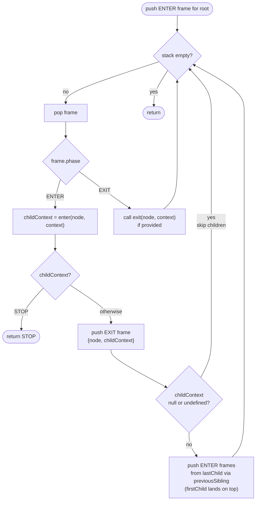

# `walkDOM` — iterative tree traversal

**Source**: [`lib/dom.js`](../lib/dom.js)

`walkDOM` visits every node in a DOM subtree in depth-first order, calling
caller-supplied `enter` and `exit` callbacks. It uses an explicit stack instead
of recursion, so it is safe on arbitrarily deep trees.

## Stack frame

Each item on the work stack is a frame with three fields:

| Field     | Purpose                                              |
|-----------|------------------------------------------------------|
| `node`    | The DOM node to process                              |
| `context` | Opaque value threaded through the traversal          |
| `phase`   | `ENTER` — call `enter`, schedule children and exit  |
|           | `EXIT`  — call `exit` for the matching `enter`       |

Each frame starts its life as `ENTER` and, after being processed, causes an
`EXIT` frame for the same node to be pushed. The `EXIT` frame fires only after
all descendants have been fully processed — which is exactly the post-order
guarantee.

## Control flow



`EXIT` is always pushed — even when children are skipped — so `exit` is called
once for every `enter`, symmetric and unconditional.

## Why pushing EXIT before children guarantees post-order

The stack is last-in-first-out. When an `ENTER` frame is processed, the following are
pushed in this order:

1. `EXIT` frame for the current node
2. `ENTER` frames for children, traversed from `lastChild` via `previousSibling` — so `firstChild` lands on top and is processed first

Because children are on top, they are processed first. The parent's `EXIT`
frame sits below all of them and fires only after the last descendant finishes.

### Stack trace

```xml
<root>
  <A>
    <A1/>
  </A>
  <B/>
</root>
```

| Step | Actions                                                                                         | Stack after <br/>(list order, last item = next to pop)          |
|------|-------------------------------------------------------------------------------------------------|-----------------------------------------------------------------|
| init | push `ENTER(root)`                                                                              | `ENTER(root)`                                                   |
| 1    | pop `ENTER(root)`,<br/> `enter(root)`,<br/> push `EXIT(root)`, `ENTER(B)`, `ENTER(A)` | `EXIT(root)`,<br/> `ENTER(B)`,<br/> `ENTER(A)`                  |
| 2    | pop `ENTER(A)`,<br/> `enter(A)`,<br/> push `EXIT(A)`, `ENTER(A1)`                          | `EXIT(root)`,<br/> `ENTER(B)`,<br/> `EXIT(A)`,<br/> `ENTER(A1)` |
| 3    | pop `ENTER(A1)`,<br/> `enter(A1)`,<br/> push `EXIT(A1)`                                         | `EXIT(root)`,<br/> `ENTER(B)`,<br/> `EXIT(A)`,<br/> `EXIT(A1)`  |
| 4    | pop `EXIT(A1)`,<br/> `exit(A1)`                                                                 | `EXIT(root)`,<br/> `ENTER(B)`,<br/> `EXIT(A)`                   |
| 5    | pop `EXIT(A)`,<br/> `exit(A)`                                                                   | `EXIT(root)`,<br/> `ENTER(B)`                                   |
| 6    | pop `ENTER(B)`,<br/> `enter(B)`,<br/> push `EXIT(B)`                                            | `EXIT(root)`,<br/> `EXIT(B)`                                    |
| 7    | pop `EXIT(B)`,<br/> `exit(B)`                                                                   | `EXIT(root)`                                                    |
| 8    | pop `EXIT(root)`,<br/> `exit(root)`                                                             | _(empty)_                                                       |

Call order: `enter(root)` → `enter(A)` → `enter(A1)` → `exit(A1)` → `exit(A)` → `enter(B)` → `exit(B)` → `exit(root)`.

## Context isolation

The value returned by `enter` becomes `childContext`. It is stored in:

- the `EXIT` frame, so `exit` receives exactly what `enter` returned
- all children's `ENTER` frames, so each child starts with the parent's output

Siblings share the same `childContext` reference from their common parent.
Callers that need per-element isolation must produce a fresh value inside
`enter` (e.g. `namespaces.slice()` in `serializeToString`).

## DOM mutation during traversal

Only mutations to a node's **own children** inside its `enter` callback are
supported. Because `lastChild` and `previousSibling` are read after `enter` returns, any
children added or removed there are correctly reflected when the walker
schedules the next level of frames.

An example of that is the `Node.prototype.normalize` method.

Mutating anything else — siblings of the current node, ancestors, or unrelated
subtrees — produces unpredictable results. Nodes already queued on the stack
are visited regardless of subsequent DOM changes; nodes inserted outside the
current child list are never queued and therefore never visited. Neither
`enter` nor `exit` is guaranteed to be called for such nodes.

## `walkDOM.STOP`

Returning `walkDOM.STOP` from `enter` causes the function to return `STOP`
immediately, discarding the rest of the stack. No further `enter` or `exit`
calls are made — including any pending `EXIT` frames for ancestors.
