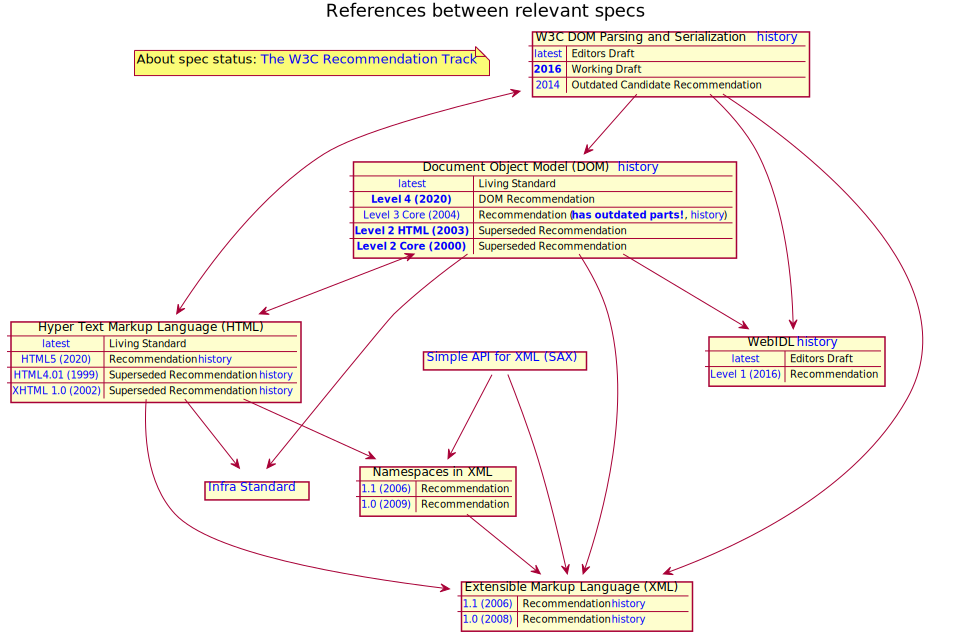

# XMLDOM

[](LICENSE)
[](https://www.npmjs.com/package/xmldom)
[](https://github.com/xmldom/xmldom/issues?q=is%3Aissue+is%3Aopen+label%3Abug)
[](https://github.com/xmldom/xmldom/issues?q=is%3Aissue+is%3Aopen+label%3A%22help+wanted%22)
[](https://dashboard.stryker-mutator.io/reports/github.com/brodybits/xmldom/master)

xmldom is a javascript [ponyfill](https://ponyfill.com/) for the following APIs supported in browsers:
- convert an XML string into a DOM tree (`new DOMParser().parseFromString(xml, mimeType)` => `Document`)
- create, access and modify a DOM tree (`new DOMImplementation().createDocument(...)` => `Document`, )
- serialize a DOM tree back into an XML string (`new XMLSerializer().serializeToString(node)` => `string`)

Note that this `xmldom` library is not required if your code targets a modern browser. But this library is recommended if your code needs to also work in other runtimes like NodeJS or Rhino.

## Specs

The implementation is based on several specifications:

<!-- Should open in new tab and the links in the SVG should be clickable there! -->
<a href="https://raw.githubusercontent.com/xmldom/xmldom/master/docs/specs.svg" target="_blank" rel="noopener noreferrer nofollow" ></a>

### DOM Parsing and Serialization

From the [W3C DOM Parsing and Serialization (WD 2016)](https://www.w3.org/TR/2016/WD-DOM-Parsing-20160517/) `xmldom` provides an implementation for the interfaces:
- `DOMParser`
- `XMLSerializer`

Note that there are some known deviations between this implementation and the W3 specifications.

Note: [The latest version of this spec](https://w3c.github.io/DOM-Parsing/) has the status "Editors Draft", since it is under active development. One major change is that [the definition of the `DOMParser` interface has been moved to the HTML spec](https://w3c.github.io/DOM-Parsing/#the-domparser-interface)


### DOM

The original author claims that xmldom implements [DOM Level 2] in a "fully compatible" way and some parts of [DOM Level 3], but there are not enough tests to prove this. Both Specifications are now superseded by the [DOM Level 4 aka Living standard] wich has a much broader scope than xmldom.

xmldom implements the following interfaces (most constructors are currently not exposed):
- `Attr`
- `CDATASection`
- `CharacterData`
- `Comment`
- `Document`
- `DocumentFragment`
- `DocumentType`
- `DOMException` (constructor exposed) 
- `DOMImplementation` (constructor exposed)
- `Element`
- `Entity`
- `EntityReference`
- `LiveNodeList`
- `NamedNodeMap`
- `Node` (constructor exposed)
- `NodeList`
- `Notation`
- `ProcessingInstruction`
- `Text`

more details are available in the (incomplete) [API Reference](#api-reference) section.

### HTML

xmldom does not have any goal of supporting the full spec, but it has some capability to parse, report and serialize things differently when "detecting HTML" (by checking the default namespace).
There is an upcoming change to better align the implementation with the latest specs, related to <https://github.com/xmldom/xmldom/issues/203>.

### SAX, XML, XMLNS

xmldom has an own SAX parser implementation to do the actual parsing, which implements some interfaces in alignment with the Java interfaces SAX defines:
- `XMLReader`
- `DOMHandler`

There is an idea/proposal to make ti possible to replace it with something else in <https://github.com/xmldom/xmldom/issues/55>

## Forked

**Original project location:** <https://github.com/jindw/xmldom>

More details about the transition can be found in the [CHANGELOG](CHANGELOG.md#maintainer-changes) and in <https://github.com/xmldom/xmldom/issues/62>

## Usage

### Install:

> npm install xmldom

### Example:

```javascript
const { DOMParser } = require('xmldom')

const doc = new DOMParser().parseFromString(
    '<xml xmlns="a" xmlns:c="./lite">\n' +
        '\t<child>test</child>\n' +
        '\t<child></child>\n' +
        '\t<child/>\n' +
        '</xml>',
    'text/xml'
)
doc.documentElement.setAttribute('x', 'y')
doc.documentElement.setAttributeNS('./lite', 'c:x', 'y2')
console.info(doc)

const nsAttr = doc.documentElement.getAttributeNS('./lite', 'x')
console.info(nsAttr)
```

Note: in Typescript and ES6 you can use the import approach, as follows:

```javascript
import { DOMParser } from 'xmldom'
```

## API Reference

 * [DOMParser](https://developer.mozilla.org/en-US/docs/Web/API/DOMParser):

	```javascript
	parseFromString(xmlsource,mimeType)
	```
	* **options extension** _by xmldom_(not BOM standard!!)

	```javascript
	//added the options argument
	new DOMParser(options)
	
	//errorHandler is supported
	new DOMParser({
		/**
		 * locator is always need for error position info
		 */
		locator:{},
		/**
		 * you can override the errorHandler for xml parser
		 * @link http://www.saxproject.org/apidoc/org/xml/sax/ErrorHandler.html
		 */
		errorHandler:{warning:function(w){console.warn(w)},error:callback,fatalError:callback}
		//only callback model
		//errorHandler:function(level,msg){console.log(level,msg)}
	})
		
	```

 * [XMLSerializer](https://developer.mozilla.org/en-US/docs/Web/API/XMLSerializer)
 
	```javascript
	serializeToString(node)
	```
### DOM level2 method and attribute:

 * [Node](http://www.w3.org/TR/2000/REC-DOM-Level-2-Core-20001113/core.html#ID-1950641247)
	
		attribute:
			nodeValue|prefix
		readonly attribute:
			nodeName|nodeType|parentNode|childNodes|firstChild|lastChild|previousSibling|nextSibling|attributes|ownerDocument|namespaceURI|localName
		method:	
			insertBefore(newChild, refChild)
			replaceChild(newChild, oldChild)
			removeChild(oldChild)
			appendChild(newChild)
			hasChildNodes()
			cloneNode(deep)
			normalize()
			isSupported(feature, version)
			hasAttributes()
* [DOMException](http://www.w3.org/TR/2000/REC-DOM-Level-2-Core-20001113/ecma-script-binding.html)
   The DOMException class has the following constants (and `value` of type `Number`):
  
  1. `DOMException.INDEX_SIZE_ERR` (`1`)
  1. `DOMException.DOMSTRING_SIZE_ERR` (`2`)
  1. `DOMException.HIERARCHY_REQUEST_ERR` (`3`)
  1. `DOMException.WRONG_DOCUMENT_ERR` (`4`)
  1. `DOMException.INVALID_CHARACTER_ERR` (`5`)
  1. `DOMException.NO_DATA_ALLOWED_ERR` (`6`)
  1. `DOMException.NO_MODIFICATION_ALLOWED_ERR` (`7`)
  1. `DOMException.NOT_FOUND_ERR` (`8`)
  1. `DOMException.NOT_SUPPORTED_ERR` (`9`)
  1. `DOMException.INUSE_ATTRIBUTE_ERR` (`10`)
  1. `DOMException.INVALID_STATE_ERR` (`11`)
  1. `DOMException.SYNTAX_ERR` (`12`)
  1. `DOMException.INVALID_MODIFICATION_ERR` (`13`)
  1. `DOMException.NAMESPACE_ERR` (`14`)
  1. `DOMException.INVALID_ACCESS_ERR` (`15`)
   
   The DOMException object has the following properties:
   code
   This property is of type Number.

	 * extends the Error type thrown as part of DOM API:

 * [DOMImplementation](http://www.w3.org/TR/2000/REC-DOM-Level-2-Core-20001113/core.html#ID-102161490)
		
		method:
			hasFeature(feature, version)
			createDocumentType(qualifiedName, publicId, systemId)
			createDocument(namespaceURI, qualifiedName, doctype)

 * [Document](http://www.w3.org/TR/2000/REC-DOM-Level-2-Core-20001113/core.html#i-Document) : Node
		
		readonly attribute:
			doctype|implementation|documentElement
		method:
			createElement(tagName)
			createDocumentFragment()
			createTextNode(data)
			createComment(data)
			createCDATASection(data)
			createProcessingInstruction(target, data)
			createAttribute(name)
			createEntityReference(name)
			getElementsByTagName(tagname)
			importNode(importedNode, deep)
			createElementNS(namespaceURI, qualifiedName)
			createAttributeNS(namespaceURI, qualifiedName)
			getElementsByTagNameNS(namespaceURI, localName)
			getElementById(elementId)

 * [DocumentFragment](http://www.w3.org/TR/2000/REC-DOM-Level-2-Core-20001113/core.html#ID-B63ED1A3) : Node
 * [Element](http://www.w3.org/TR/2000/REC-DOM-Level-2-Core-20001113/core.html#ID-745549614) : Node
		
		readonly attribute:
			tagName
		method:
			getAttribute(name)
			setAttribute(name, value)
			removeAttribute(name)
			getAttributeNode(name)
			setAttributeNode(newAttr)
			removeAttributeNode(oldAttr)
			getElementsByTagName(name)
			getAttributeNS(namespaceURI, localName)
			setAttributeNS(namespaceURI, qualifiedName, value)
			removeAttributeNS(namespaceURI, localName)
			getAttributeNodeNS(namespaceURI, localName)
			setAttributeNodeNS(newAttr)
			getElementsByTagNameNS(namespaceURI, localName)
			hasAttribute(name)
			hasAttributeNS(namespaceURI, localName)

 * [Attr](http://www.w3.org/TR/2000/REC-DOM-Level-2-Core-20001113/core.html#ID-637646024) : Node
	
		attribute:
			value
		readonly attribute:
			name|specified|ownerElement

 * [NodeList](http://www.w3.org/TR/2000/REC-DOM-Level-2-Core-20001113/core.html#ID-536297177)
		
		readonly attribute:
			length
		method:
			item(index)
	
 * [NamedNodeMap](http://www.w3.org/TR/2000/REC-DOM-Level-2-Core-20001113/core.html#ID-1780488922)

		readonly attribute:
			length
		method:
			getNamedItem(name)
			setNamedItem(arg)
			removeNamedItem(name)
			item(index)
			getNamedItemNS(namespaceURI, localName)
			setNamedItemNS(arg)
			removeNamedItemNS(namespaceURI, localName)
		
 * [CharacterData](http://www.w3.org/TR/2000/REC-DOM-Level-2-Core-20001113/core.html#ID-FF21A306) : Node
	
		method:
			substringData(offset, count)
			appendData(arg)
			insertData(offset, arg)
			deleteData(offset, count)
			replaceData(offset, count, arg)
		
 * [Text](http://www.w3.org/TR/2000/REC-DOM-Level-2-Core-20001113/core.html#ID-1312295772) : CharacterData
	
		method:
			splitText(offset)
			
 * [CDATASection](http://www.w3.org/TR/2000/REC-DOM-Level-2-Core-20001113/core.html#ID-667469212)
 * [Comment](http://www.w3.org/TR/2000/REC-DOM-Level-2-Core-20001113/core.html#ID-1728279322) : CharacterData
	
 * [DocumentType](http://www.w3.org/TR/2000/REC-DOM-Level-2-Core-20001113/core.html#ID-412266927)
	
		readonly attribute:
			name|entities|notations|publicId|systemId|internalSubset
			
 * Notation : Node
	
		readonly attribute:
			publicId|systemId
			
 * Entity : Node
	
		readonly attribute:
			publicId|systemId|notationName
			
 * EntityReference : Node 
 * ProcessingInstruction : Node 
	
		attribute:
			data
		readonly attribute:
			target
		
### DOM level 3 support:

 * [Node](http://www.w3.org/TR/DOM-Level-3-Core/core.html#Node3-textContent)
		
		attribute:
			textContent
		method:
			isDefaultNamespace(namespaceURI){
			lookupNamespaceURI(prefix)

### DOM extension by xmldom

* [Node] Source position extension; 
		
		attribute:
			//Numbered starting from '1'
			lineNumber
			//Numbered starting from '1'
			columnNumber
